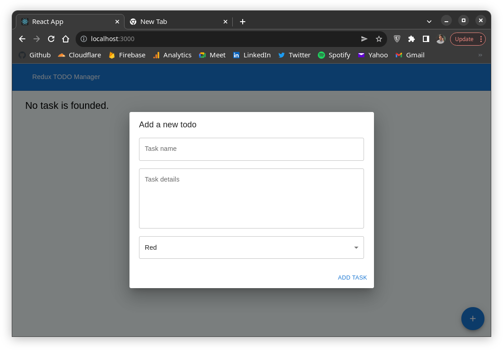
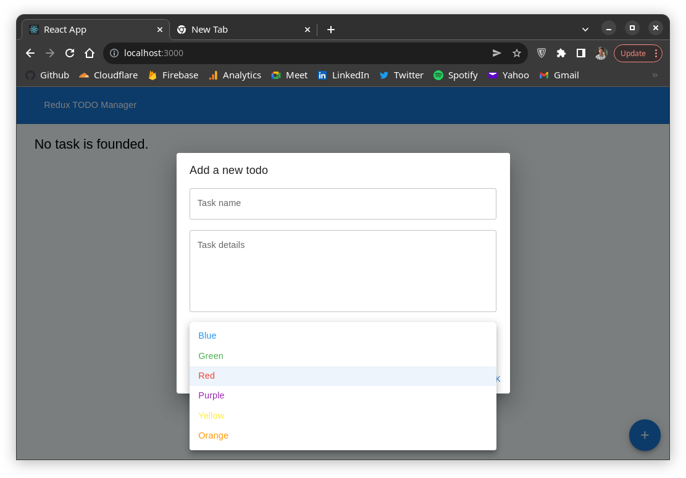
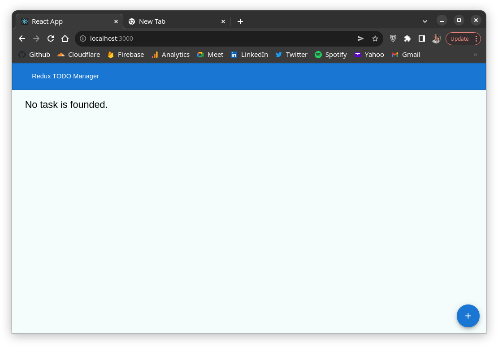
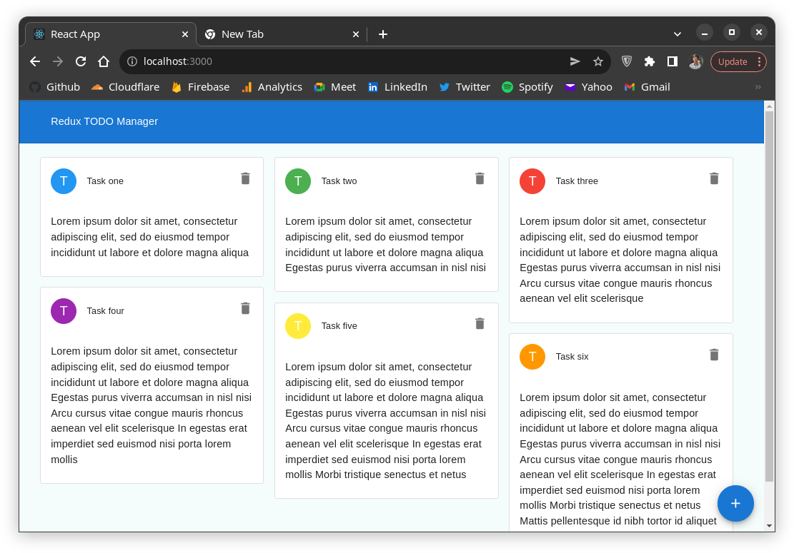
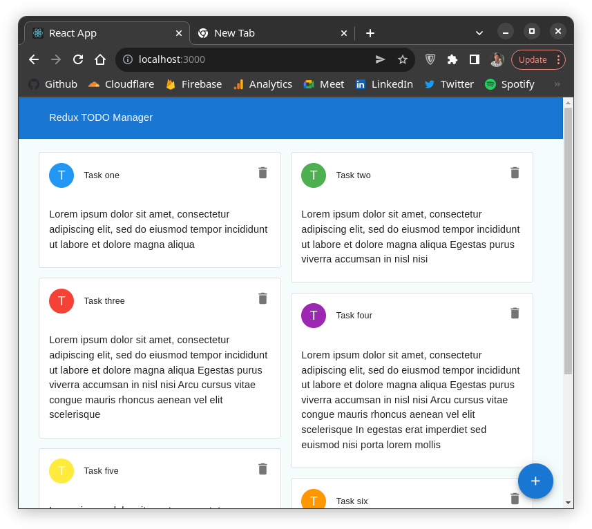
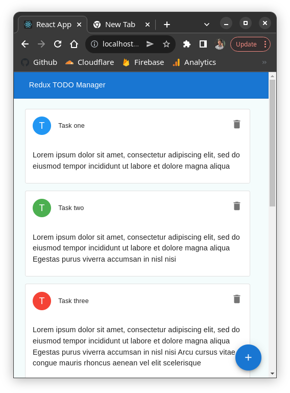

# React + Redux course

In this course you learn how to use **Redux** as a state manager in your **React** applications.

With **Redux** you can access your data easily and save them. In this project I used **Material UI**. If you want to learn about **MUI**, I have a small project you can check this out [here](https://github.com/BlackIQ/react-mui-tutorial).

## Redux

So, Redux is a state manager you can use with React, Vue and even Vanilla. Redux has 4 important thingg.

- Reducers
- Actions
- Store

### Reducers

Reducers are functions that take the current state and an action as arguments, and return a new state result. In other words, `(state, action) => newState`.

Creating a reducer is as simple as you can see down below:

```javascript
// src/redux/reducers/todo.js
const todoReducer = (state = [], action) => {
    switch (action.type) {
        case "ADD_TODO":
            return state.concat(action.payload);
        case "DELETE_TODO":
            return state.filter(data => data !== action.payload);
        default:
            return state;
    }
}
```

When we have several reducers, we need to **combine** them in a variable.

Create an index file in `src/redux/reducers`. Now combine all reducers:

```javascript
// src/redux/reducers/index.js

import { combineReducers } from "redux";

const allReducers = combineReducers({
    todo: todoReducer,
});
```

### Actions

Actions are plain JavaScript objects that have a type field. As mentioned earlier, you can think of an action as an event that describes something that happened in the application.

To create an action, create `actions` directory inside redux directory. I added all actions in `index.js`. You can store actions in their files.

```javascript
export const addTodo = (todo) => {
    return {
        type: "ADD_TODO",
        payload: todo,
    };
}

export const deleteTodo = (todo) => {
    return {
        type: "DELETE_TODO",
        payload: todo,
    };
}
```

### Store

The Redux store brings together the state, actions, and reducers that make up your app. The store has several responsibilities:

- Holds the current application state inside
- Allows access to the current state via store.getState();
- Allows state to be updated via store.dispatch(action);
- Registers listener callbacks via store.subscribe(listener);
- Handles unregistering of listeners via the unsubscribe function returned by store.subscribe(listener).

Where to create or store? open `index.js` that is in `src`.

```javascript
import { createStore } from "redux";

import allReducers from './redux/reducers';

let store = createStore(allReducers);
```

So, now we have the store that is created. How to provide this store inside the whole app. We use `Provider`.

```javascript
import { createStore } from "redux";

// Import Provider
import { Provider } from 'react-redux';

import allReducers from './redux/reducers';

let store = createStore(allReducers);

const root = ReactDOM.createRoot(document.getElementById('root'));
root.render(
    // Add provider with store as prop
    <Provider store={store}>
        <App/>
    </Provider>
);
```

Done! You now had set up Redux.

## Local Storage

When you setup Redux, it will only store the data until you don't refresh the app. When you refresh the app or open it in another tab, the data will be start over.

So, what should you do? The best way is to store data in **localstorage**. But, how to do it?

Follow these steps:

- Create storage directory in redux directory
- Add load and save functions
- Integrate localstorage in redux

I imagine you created the localstorage file in storage directory inside redux and start from second step.

### Create state name

You add a key variable to use for entire file.

```javascript
const key = 'redux';
```

### Add load function

```javascript
export const loadState = () => {
    try {
        const serializedState = localStorage.getItem(key);

        if (serializedState === null) {
            return undefined;
        }

        return JSON.parse(serializedState);

    } catch (error) {
        return undefined;
    }
};
```

### Add save function

```javascript
export const saveState = (state) => {
    try {
        const serializedState = JSON.stringify(state);
        localStorage.setItem(key, serializedState);
    } catch (error) {
        // die
    }
};
```

### Integrate with Redux

Open `index.js` in `src`.

Now import them:

```javascript
import { loadState, saveState } from "./redux/storage/localstore";
```

Ok, create a variable that represent data from localstorage.

```javascript
const persistedState = loadState();
```

Edit the `createStore` with represented data:

```javascript
let store = createStore(
    allReducers,
    persistedState
);
```

Last step, saving data. Now you should do something that update the state in localstorage. We will use `saveState()`.

```javascript
store.subscribe(() => saveState({
    todo: store.getState().todo
}));
```

## Application

This is a very simple app. There is a Floating action button that open the add dialog like thus:

Here, you enter the name.



Also, you can select what color you want.



If your storage be empty, you will see this:



But, here are some stuff I had added.



BTW, Application is responsive :)

- In tablet


- In mobile
